# LỜI MỞ ĐẦU

Trong bối cảnh thương mại điện tử phát triển mạnh mẽ, việc xây dựng và duy trì kênh bán hàng trực tuyến đã trở thành xu hướng tất yếu của các doanh nghiệp. Internet không chỉ mở ra một thị trường rộng lớn, mà còn mang đến cơ hội tiếp cận khách hàng nhanh chóng, thuận tiện và hiệu quả hơn so với phương thức kinh doanh truyền thống.

Đối với ngành dịch vụ ăn uống (F&B), hành vi đặt món và thanh toán ngày càng dịch chuyển sang các kênh số. Khách hàng mong muốn có một nền tảng hiện đại, dễ sử dụng để xem thực đơn, lựa chọn món theo nhu cầu, đặt món nhanh chóng và theo dõi trạng thái. Đồng thời, nhà hàng cũng cần một hệ thống hỗ trợ vận hành tại bàn (staff đặt món nhanh, gom đơn theo bàn, thanh toán), giúp giảm sai sót và tăng hiệu quả phục vụ.

Xuất phát từ thực tiễn trên, nhóm chúng em chọn thực hiện đề tài: **“Xây dựng hệ thống quản lý nhà hàng kết hợp chức năng đặt món (E-commerce)”**.

Thông qua quá trình thực hiện, nhóm hy vọng đề tài không chỉ giúp nâng cao kỹ năng phân tích, thiết kế và phát triển phần mềm, mà còn mang lại một giải pháp thực tiễn hỗ trợ hoạt động kinh doanh trong lĩnh vực thương mại điện tử, áp dụng trực tiếp vào dự án `mis_restaurant`.

---

# MỤC LỤC

- LỜI CẢM ƠN (I)
- LỜI MỞ ĐẦU (II)
- DANH MỤC HÌNH VẼ
- DANH MỤC BẢNG BIỂU

## CHƯƠNG 1: GIỚI THIỆU ĐỀ TÀI

- 1.1 Giới thiệu về TPS – Hệ thống xử lý giao dịch (Transaction Processing Systems)
  - 1.1.1 Khái niệm giao dịch và đặc trưng của TPS
  - 1.1.2 Vai trò của TPS trong doanh nghiệp
  - 1.1.3 Kết luận
- 1.2 Lý do chọn đề tài
- 1.3 Vấn đề thực tế mà đề tài giải quyết
- 1.4 Yêu cầu hệ thống
- 1.5 Mục tiêu và chức năng hệ thống
  - 1.5.1 Mục tiêu của hệ thống
  - 1.5.2 Chức năng của hệ thống

## CHƯƠNG 2: CÔNG NGHỆ SỬ DỤNG

- 2.1 Front-End
  - 2.1.1 HTML
  - 2.1.2 CSS
  - 2.1.3 JavaScript
  - 2.1.4 Blade Template + Livewire
- 2.2 Back-End
  - 2.2.1 PHP
  - 2.2.2 Laravel Framework + Eloquent ORM
  - 2.2.3 Livewire + Event/Broadcasting
- 2.3 Database
- 2.4 Một số dịch vụ bên thứ 3
  - 2.4.1 Thanh toán QR (SePay/VNPay/Chuyển khoản) và dịch vụ tạo QR

## CHƯƠNG 3: PHÂN TÍCH VÀ THIẾT KẾ HỆ THỐNG

- 3.1 Biểu đồ usecase
  - 3.1.1 Biểu đồ usecase tổng quan hệ thống
  - 3.1.2 Các usecase phân rã
- 3.2 Xây dựng kịch bản
  - 3.2.1 Các kịch bản ứng với chức năng của người dùng
  - 3.2.2 Các kịch bản ứng với các chứng năng của quản trị hệ thống
- 3.3 Xây dựng biểu đồ lớp phân tích
  - 3.3.1 Biểu đồ lớp phân tích
  - 3.3.2 Xác định quan hệ giữa các lớp
- 3.4 Thiết kế các biểu đồ tuần tự
  - 3.4.1 Biểu đồ tuần tự của usecase “Đăng nhập tài khoản người dùng”
  - 3.4.2 Biểu đồ tuần tự của usecase “Đăng ký tài khoản của người dùng”
  - 3.4.3 Biểu đồ tuần tự của usecase “Tìm kiếm sản phẩm”
  - 3.4.4 Biểu đồ tuần tự của usecase “Xem thông tin chi tiết sản phẩm”
  - 3.4.5 Biểu đồ tuần tự của usecase “Xem danh sách hóa đơn”
  - 3.4.6 Biểu đồ tuần tự của usecase “Đặt mua hàng”
  - 3.4.7 Biểu đồ tuần tự của usecase “Thanh toán online”
  - 3.4.8 Biểu đồ tuần tự của usecase “Xem bài viết Công trình toàn diện”
  - 3.4.9 Biểu đồ tuần tự của usecase “Xem bài viết giải pháp âm thanh”
  - 3.4.10 Biểu đồ tuần tự của usecase “Quản lý tài khoản của người dùng”
  - 3.4.11 Biểu đồ tuần tự của usecase “Quản lý sản phẩm”
  - 3.4.12 Biểu đồ tuần tự của usecase “Quản lý loại sản phẩm”
  - 3.4.13 Biểu đồ tuần tự của usecase “Quản lý hãng sản phẩm”
  - 3.4.14 Biểu đồ tuần tự của usecase “Quản lý danh sách hóa đơn của người dùng”
  - 3.4.15 Biểu đồ tuần tự của usecase “Quản lý về các bài viết giải pháp âm thanh”
  - 3.4.16 Biểu đồ tuần tự của usecase “Quản lý về các bài viết công trình toàn diện”
- 3.5 Thiết kế cơ sở dữ liệu
  - 3.5.1 Lược đồ cơ sở dữ liệu hệ thống
  - 3.5.2 Cơ sở dữ liệu vật lý

## CHƯƠNG 4: CÀI ĐẶT ỨNG DỤNG

- 4.1 Hướng dẫn chạy source code web
- 4.2 Giao diện hệ thống người dùng
  - 4.2.1 Giao diện trang chủ khách hàng
  - 4.2.2 Giao diện menu/thực đơn
  - 4.2.3 Giao diện giỏ hàng
  - 4.2.4 Giao diện checkout/đặt món
  - 4.2.5 Giao diện lịch sử đơn hàng
- 4.3 Giao diện hệ thống quản trị viên
  - 4.3.1 Giao diện staff chọn bàn/đặt món
  - 4.3.2 Giao diện staff quản lý đơn theo bàn
  - 4.3.3 Giao diện staff thanh toán (tạo QR/xác nhận)
  - 4.3.4 Giao diện admin quản lý danh mục/menu
  - 4.3.5 Giao diện admin quản lý nhân sự/ca làm/chấm công

## CHƯƠNG 5: KẾT LUẬN VÀ ĐÁNH GIÁ

- 5.1 Kết quả đạt được
- 5.2 Các hạn chế
- 5.3 Định hướng phát triển

## TÀI LIỆU THAM KHẢO

---

# CHƯƠNG 1: GIỚI THIỆU ĐỀ TÀI

## 1.1 Giới thiệu về TPS – Hệ thống xử lý giao dịch (Transaction Processing Systems)

### 1.1.1 Khái niệm giao dịch và đặc trưng của TPS

Trong một hệ thống quản lý nhà hàng, **giao dịch (transaction)** là các thao tác nghiệp vụ phát sinh liên tục và cần độ chính xác cao, ví dụ: tạo đơn đặt món, cập nhật trạng thái món (đã/chưa hoàn thành), xác nhận thanh toán. Với dự án `mis_restaurant`, các giao dịch thể hiện rõ ở luồng chính:

- **Staff đặt món tại bàn**: staff chọn bàn → chọn món → tạo `order_group_id` (ví dụ `ORD-ABC123-1234567890`) để gom nhiều dòng `Transaction` (mỗi món là một dòng) thành một nhóm đơn theo bàn.
- **Staff thanh toán**: staff chọn các `order_group_id` cần thanh toán → tạo QR (nếu thanh toán QR) → xác nhận thanh toán → cập nhật `payment_status` và trạng thái bàn.

TPS (Transaction Processing System) là hệ thống chuyên xử lý các giao dịch như trên và đảm bảo dữ liệu **nhất quán**. Trong code của dự án, các nghiệp vụ quan trọng (đặt món, tạo payment, xác nhận thanh toán) đều được bao trong **DB transaction** (`DB::beginTransaction()`), giúp đảm bảo tính nguyên tử: hoặc thành công toàn bộ, hoặc rollback.

**Tính năng mở rộng (tùy chọn)**: Hệ thống cũng hỗ trợ customer đặt món online với giỏ hàng `TemporaryOrder` → checkout tạo `Transaction`, nhưng đây không phải luồng chính của dự án.

### 1.1.2 Vai trò của TPS trong doanh nghiệp

TPS giúp nhà hàng vận hành ổn định khi lượng đặt món tăng, đặc biệt vào giờ cao điểm:

- **Giảm sai sót** khi ghi nhận món/giá/số lượng.
- **Tăng tốc phục vụ**: staff chọn bàn → đặt món nhanh → theo dõi món chưa giao.
- **Thanh toán minh bạch**: tính tổng tiền theo nhóm đơn (`order_group_id`), tạo QR, xác nhận thanh toán và cập nhật trạng thái.
- **Dễ kiểm soát**: truy vết lịch sử theo bàn, theo khách hàng, theo thời gian.

### 1.1.3 Kết luận

Dự án `mis_restaurant` có thể xem như một TPS ứng dụng vào bài toán e-commerce đặt món tại nhà hàng, tập trung vào tính đúng đắn của dữ liệu đặt món và thanh toán.

## 1.2 Lý do chọn đề tài

- Nhu cầu số hóa nhà hàng tăng: xem menu, đặt món, thanh toán QR.
- Cần giảm phụ thuộc vào giấy/ghi chú thủ công, tránh thất thoát đơn và nhầm lẫn.
- Cần một hệ thống vừa hỗ trợ **vận hành nội bộ** (staff/admin) vừa hỗ trợ **trải nghiệm khách hàng** (customer đặt món như e-commerce).

## 1.3 Vấn đề thực tế mà đề tài giải quyết

- Khách hàng cần đặt món nhanh, rõ ràng thông tin món và giá.
- Staff cần đặt món tại bàn, gom đơn theo lượt gọi món, theo dõi trạng thái món đã/ chưa hoàn thành.
- Thanh toán cần linh hoạt (QR/tiền mặt/chuyển khoản), hỗ trợ thanh toán sớm và “trừ món” trước khi tạo thanh toán.
- Quản lý cần theo dõi đơn, nhân sự/ca làm/chấm công và thông báo theo thời gian thực.

## 1.4 Yêu cầu hệ thống

### Yêu cầu chức năng

- **Customer**: xem menu, thêm giỏ hàng, cập nhật giỏ hàng, checkout tạo đơn, xem lịch sử đơn hàng.
- **Staff**: chọn bàn, đặt món nhanh, xem đơn theo bàn (group theo `order_group_id`), thanh toán (tạo QR, xác nhận), cập nhật trạng thái bàn.
- **Admin**: quản lý danh mục/menu, quản lý khách hàng/nhân viên, ca làm/chấm công, xem thông báo.
- **Thông báo**: phát sinh đơn mới/thanh toán thành công có notification (có hỗ trợ broadcast).

### Yêu cầu phi chức năng

- **Độ tin cậy**: các thao tác tạo đơn/thanh toán phải đảm bảo rollback khi lỗi.
- **Bảo mật**: xác thực và phân quyền theo middleware (customer/staff/admin).
- **Hiệu năng**: truy vấn theo bàn/nhóm đơn rõ ràng; UI đủ nhanh khi đông người dùng.
- **Khả năng mở rộng**: dễ tích hợp payment gateway thật (SePay/VNPay webhook) về sau.

## 1.5 Mục tiêu và chức năng hệ thống

### 1.5.1 Mục tiêu của hệ thống

- Xây dựng hệ thống quản lý nhà hàng có luồng e-commerce đặt món hoàn chỉnh.
- Chuẩn hóa dữ liệu đặt món và thanh toán theo tư duy TPS.
- Cung cấp giao diện thân thiện cho customer và công cụ vận hành cho staff/admin.

### 1.5.2 Chức năng của hệ thống

Hình minh họa usecase tổng quan và phân rã được cung cấp trong **Phụ lục A** (A.1, A.2).

---

# CHƯƠNG 2: CÔNG NGHỆ SỬ DỤNG

## 2.1 Front-End

### 2.1.1 HTML

HTML xây dựng cấu trúc các trang: menu, giỏ hàng, checkout, lịch sử đơn; staff chọn bàn/đặt món; admin quản lý.

### 2.1.2 CSS

Dự án sử dụng TailwindCSS (kết hợp CSS tùy chỉnh) để đảm bảo giao diện nhất quán và responsive.

### 2.1.3 JavaScript

JavaScript phục vụ tương tác UI (cập nhật tổng tiền, chọn món/checkbox khi thanh toán), gọi API/AJAX khi cần. Dự án có sử dụng các thư viện như Axios và Turbolinks.

### 2.1.4 Blade Template + Livewire

- **Blade** là template engine của Laravel để render giao diện server-side.
- **Livewire** hỗ trợ xây dựng UI động theo hướng component (phù hợp cho các màn hình có tương tác và refresh dữ liệu).

## 2.2 Back-End

### 2.2.1 PHP

Backend được xây dựng bằng PHP, đáp ứng tốt cho hệ thống web CRUD và nghiệp vụ giao dịch.

### 2.2.2 Laravel Framework + Eloquent ORM

- Laravel cung cấp routing, middleware, auth, validation, và cấu trúc dự án rõ ràng.
- Eloquent ORM ánh xạ model–database, hỗ trợ query và quan hệ dữ liệu.
- Các controller tiêu biểu liên quan e-commerce: `CartController`, `CheckoutController`, `CustomerOrderController`, `StaffOrderController`, `PaymentController`.

### 2.2.3 Livewire + Event/Broadcasting

Hệ thống có event/broadcasting để phục vụ thông báo thời gian thực, ví dụ: `NewOrderCreated`, `PaymentSuccess` (có cấu hình Redis broadcasting).

## 2.3 Database

Hệ thống sử dụng MySQL (phù hợp triển khai qua Docker). Các bảng chính phục vụ e-commerce đặt món gồm: `menus`, `menu_options`, `temporary_orders`, `transactions`, `payments`, `tables`, `users`… Lược đồ tham khảo trong **Phụ lục A.5**.

## 2.4 Một số dịch vụ bên thứ 3

### 2.4.1 Thanh toán QR (SePay/VNPay/Chuyển khoản) và dịch vụ tạo QR

Trong luồng thanh toán staff, hệ thống hỗ trợ nhiều **payment method**: `sepay_qr`, `vnpay_qr`, `bank_transfer`, `cash`. Hiện tại phần tạo QR sử dụng dịch vụ tạo QR công khai (API QRServer) như một bước “placeholder”, đồng thời đã chuẩn bị sẵn điểm mở rộng cho webhook gateway thật trong tương lai.

---

# CHƯƠNG 3: PHÂN TÍCH VÀ THIẾT KẾ HỆ THỐNG

## 3.1 Biểu đồ usecase

### 3.1.1 Biểu đồ usecase tổng quan hệ thống

Hệ thống có các tác nhân chính: **Customer**, **Staff**, **Admin**, và nhóm dịch vụ thanh toán QR (SePay/VNPay/Chuyển khoản). Các nhóm chức năng chính gồm: xem menu – giỏ hàng – checkout, đặt món tại bàn, thanh toán QR và quản trị dữ liệu.

**Hình 3.1**: Usecase tổng quan hệ thống (mã UML: **Phụ lục A.1**).

### 3.1.2 Các usecase phân rã

- Nhóm customer: xem menu, add/update/remove cart, checkout và xem lịch sử đơn.
- Nhóm staff: chọn bàn, đặt món nhanh, quản lý đơn theo bàn, tạo QR và xác nhận thanh toán.
- Nhóm admin: quản lý menu/danh mục, quản lý nhân sự/ca làm/chấm công, xem thông báo.

**Hình 3.2**: Usecase customer (mã UML: **Phụ lục A.2.1**).

**Hình 3.3**: Usecase staff/admin (mã UML: **Phụ lục A.2.2, A.2.3**).

## 3.2 Xây dựng kịch bản

### 3.2.1 Các kịch bản ứng với chức năng của người dùng (customer)

- **Xem menu**: truy cập menu → chọn món → chọn option (giá) → thêm vào giỏ.
- **Giỏ hàng**: xem danh sách món, cập nhật số lượng, xóa món.
- **Checkout/đặt món**: xác nhận giỏ hàng → (tùy chọn) chọn bàn → hệ thống tạo `Transaction` và xóa giỏ hàng.
- **Lịch sử đơn hàng**: xem danh sách `Transaction` theo tài khoản và xem chi tiết.

### 3.2.2 Các kịch bản ứng với chức năng của staff/admin

- **Staff đặt món tại bàn**: chọn bàn → chọn món nhanh → tạo nhóm đơn `order_group_id` và sinh nhiều `Transaction`.
- **Staff thanh toán**: chọn phương thức → tạo QR (nếu là QR) → xác nhận thanh toán → cập nhật `payment_status` của `Transaction` và trạng thái bàn.
- **Admin vận hành**: quản lý danh mục/menu; quản lý nhân sự/ca làm/chấm công; theo dõi thông báo.

## 3.3 Xây dựng biểu đồ lớp phân tích

### 3.3.1 Biểu đồ lớp phân tích

Các lớp cốt lõi bám sát model của dự án gồm: `User`, `Category`, `Menu`, `MenuOption`, `TemporaryOrder` (cart), `Transaction` (dòng đơn), `Table`, `Payment`, `Bank`, `Notification`.

**Hình 3.4**: Biểu đồ lớp phân tích (mã UML: **Phụ lục A.3**).

### 3.3.2 Xác định quan hệ giữa các lớp

- `Category`–`Menu` (1–n), `Menu`–`MenuOption` (1–n).
- `User`–`TemporaryOrder` (1–n), `TemporaryOrder` tham chiếu `Menu` và `MenuOption`.
- `Table`–`Transaction` (1–n), `Transaction` tham chiếu `Menu` và `MenuOption`.
- `Payment` gắn với `Table` và danh sách `order_group_id` (chuỗi), phục vụ thanh toán theo bàn.
- `Notification` phục vụ thông báo đơn mới và thanh toán thành công.

## 3.4 Thiết kế các biểu đồ tuần tự

Các biểu đồ tuần tự phục vụ xuất hình UML được cung cấp trong **Phụ lục A.4** (đăng nhập, add-to-cart, checkout, staff đặt món, staff thanh toán và xác nhận).

## 3.5 Thiết kế cơ sở dữ liệu

### 3.5.1 Lược đồ cơ sở dữ liệu hệ thống

Thiết kế tập trung vào dữ liệu giao dịch đặt món:

- Giỏ hàng customer được lưu ở `temporary_orders` để đảm bảo persistence.
- Đơn hàng được lưu ở `transactions` theo dạng “line item”, có thể gom nhóm theo `order_group_id` (đặc biệt cho staff đặt món tại bàn).
- Thanh toán theo bàn được lưu ở `payments`, có liên kết `tables` và các `order_group_id` cần thanh toán.

**Hình 3.5**: Lược đồ cơ sở dữ liệu hệ thống (mã UML: **Phụ lục A.5**).

### 3.5.2 Cơ sở dữ liệu vật lý

Ở mức vật lý, các bảng được triển khai với khóa chính/khóa ngoại và chỉ mục theo nhu cầu tra cứu (ví dụ: `user_id`, `table_id`, `payment_status`, `order_group_id`).

---

# CHƯƠNG 4: CÀI ĐẶT ỨNG DỤNG

## 4.1 Hướng dẫn chạy source code web

### Cách 1: Chạy bằng Docker (khuyến nghị)

1) Tạo file môi trường:

- `cp .env.docker.example .env`

2) Generate app key:

- `docker-compose run --rm artisan key:generate`

3) Build và chạy containers:

- `docker-compose up -d --build`

4) Cài dependencies:

- `docker-compose exec app composer install`
- `docker-compose exec app npm install` (nếu cần)

5) Migrate/seed:

- `docker-compose exec artisan migrate`
- `docker-compose exec artisan db:seed` (tùy chọn)

6) Truy cập:

- Web: `http://localhost:8000`
- phpMyAdmin: `http://localhost:8080`

### Cách 2: Chạy local (không dùng Docker)

1) `composer install`
2) `cp .env.example .env` và cấu hình DB
3) `php artisan key:generate`
4) `php artisan migrate`
5) `npm install && npm run dev`
6) `php artisan serve`

## 4.2 Giao diện hệ thống người dùng (customer)

- **4.2.1 Trang chủ customer**: truy cập nhanh menu và điều hướng.
- **4.2.2 Trang menu/thực đơn**: hiển thị món theo danh mục, chọn option và thêm giỏ.
- **4.2.3 Trang giỏ hàng**: cập nhật số lượng, xóa món, xem tổng tiền.
- **4.2.4 Trang checkout**: xem lại đơn, chọn bàn (tùy chọn) và xác nhận đặt món.
- **4.2.5 Lịch sử đơn hàng**: danh sách và chi tiết các dòng `Transaction` theo tài khoản.

## 4.3 Giao diện hệ thống staff/admin

- **4.3.1 Staff chọn bàn/đặt món**: chọn bàn theo zone, đặt món nhanh theo danh mục.
- **4.3.2 Staff quản lý đơn theo bàn**: gom theo `order_group_id`, theo dõi món đã/ chưa hoàn thành.
- **4.3.3 Staff thanh toán**: tạo QR, hỗ trợ thanh toán sớm và trừ món; xác nhận thanh toán.
- **4.3.4 Admin quản lý danh mục/menu**: CRUD danh mục và món.
- **4.3.5 Admin quản lý nhân sự/ca làm/chấm công**: phục vụ nghiệp vụ MIS.

---

# CHƯƠNG 5: KẾT LUẬN VÀ ĐÁNH GIÁ

## 5.1 Kết quả đạt được

- Hoàn thiện luồng e-commerce đặt món cho customer: menu → cart (`TemporaryOrder`) → checkout → tạo `Transaction`.
- Hoàn thiện luồng đặt món tại bàn cho staff với `order_group_id` và quản lý đơn theo bàn.
- Hoàn thiện luồng thanh toán theo bàn: tạo payment, tạo QR (placeholder), xác nhận thanh toán và cập nhật trạng thái bàn.
- Có hệ thống notification và event broadcasting cho đơn mới/thanh toán.

## 5.2 Các hạn chế

- Tích hợp payment gateway thật (SePay/VNPay) mới ở mức chuẩn bị (webhook còn TODO), QR hiện tạo qua dịch vụ công khai.
- `order_group_id` ở luồng customer checkout hiện chưa sinh theo nhóm (đơn tạo theo từng dòng `Transaction`), có thể cải tiến để quản lý “đơn” rõ ràng hơn.
- Chưa chuẩn hóa đầy đủ reporting/báo cáo doanh thu theo ngày/ca trong phạm vi báo cáo.

## 5.3 Định hướng phát triển

- Tích hợp gateway thật (SePay/VNPay) với webhook, chữ ký và idempotency.
- Chuẩn hóa mô hình đơn hàng: tách `orders` và `order_items` hoặc sinh `order_group_id` cho customer checkout.
- Tối ưu UI/UX và hiệu năng truy vấn theo bàn/zone; bổ sung dashboard báo cáo.

---

# TÀI LIỆU THAM KHẢO

- Tài liệu Laravel 8 (Routing, Middleware, Validation, Eloquent).
- Tài liệu Livewire (component lifecycle, binding).
- Tài liệu MySQL 8 và thiết kế CSDL quan hệ.
- Tài liệu SePay/VNPay (tham khảo tích hợp QR và webhook).
- QRServer API (dùng để tạo QR dạng placeholder trong dự án).

# PHỤ LỤC A: MÃ UML (PlantText/PlantUML)

Ghi chú: Các đoạn mã dưới đây dùng cú pháp PlantUML (tương thích PlantText). Bạn chỉ cần copy từng khối và dán lên PlantText để xuất hình.

## A.1 Usecase tổng quan hệ thống (3.1.1)

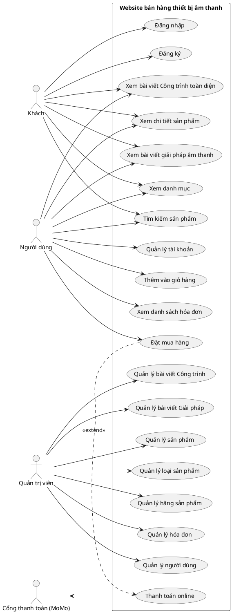

## A.2 Usecase phân rã (3.1.2)

### A.2.1 Nhóm usecase của người dùng

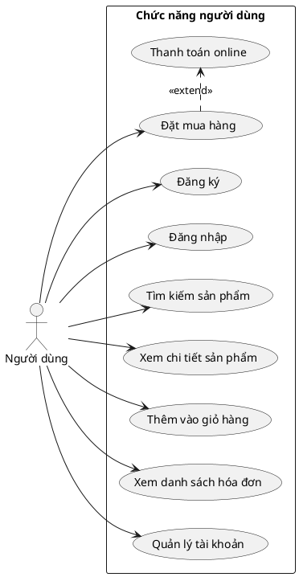

### A.2.2 Nhóm usecase của quản trị viên

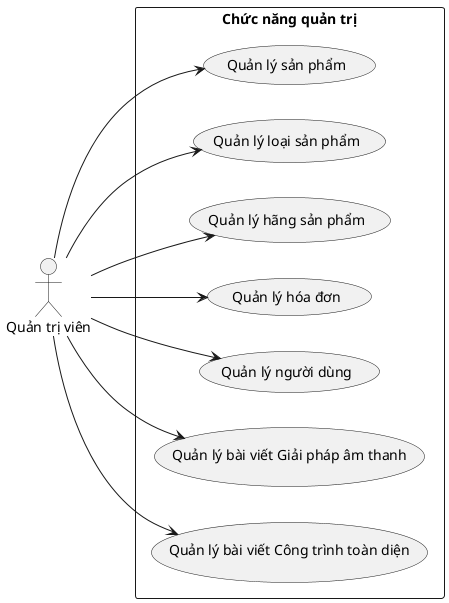

## A.3 Biểu đồ lớp phân tích (3.3.1)

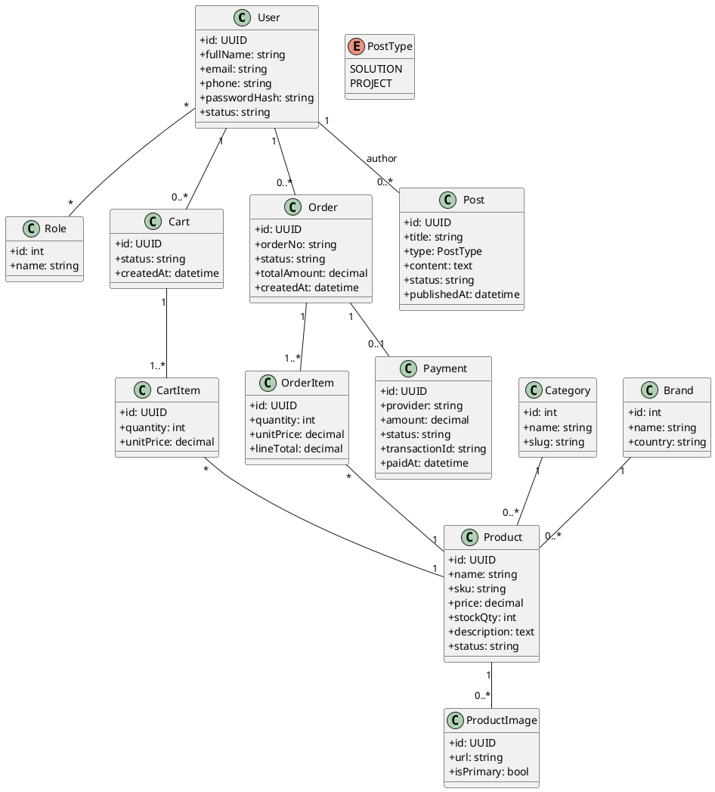

## A.4 Biểu đồ tuần tự (3.4)

### A.4.1 Đăng nhập tài khoản người dùng (3.4.1)

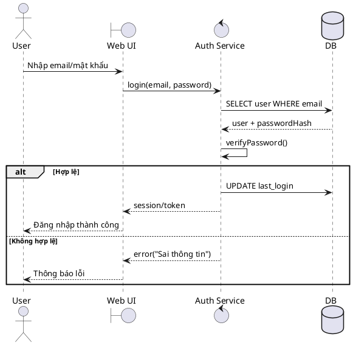

### A.4.2 Đăng ký tài khoản người dùng (3.4.2)

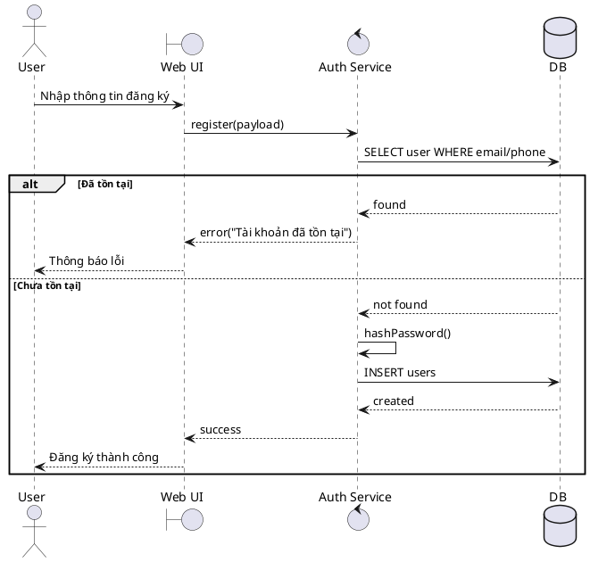

### A.4.3 Tìm kiếm sản phẩm (3.4.3)

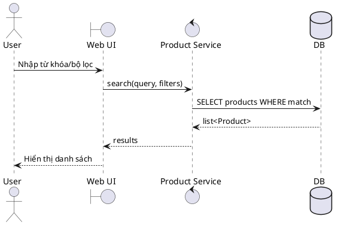

### A.4.4 Xem thông tin chi tiết sản phẩm (3.4.4)

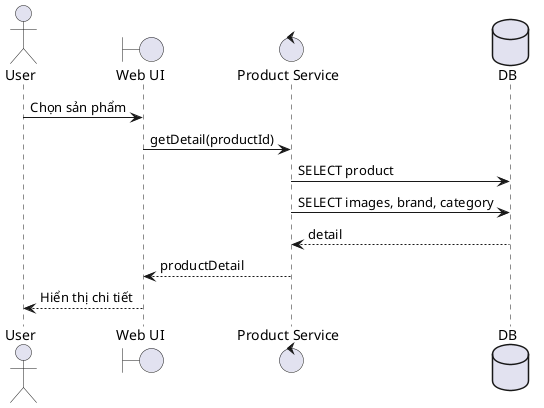

### A.4.5 Xem danh sách hóa đơn (3.4.5)

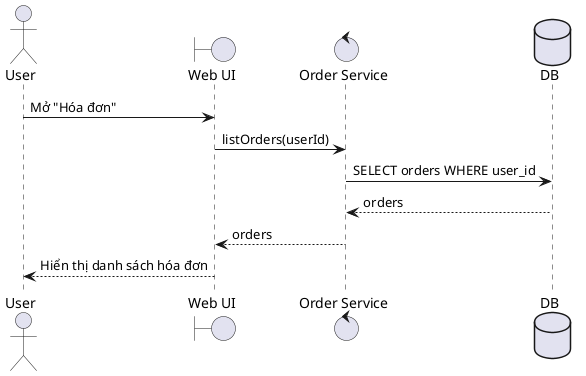

### A.4.6 Đặt mua hàng (3.4.6)

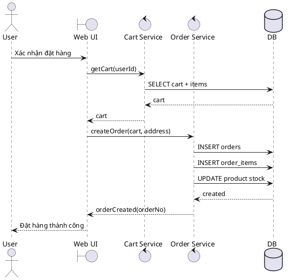

### A.4.7 Thanh toán online (3.4.7)

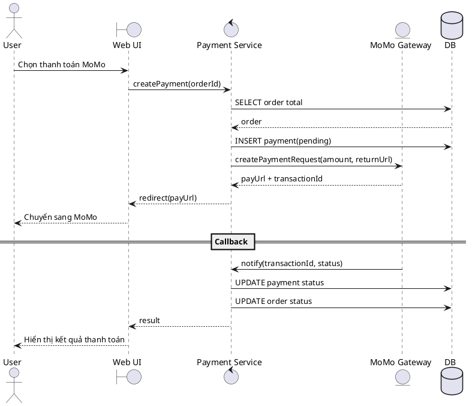

### A.4.8 Xem bài viết Công trình toàn diện (3.4.8)

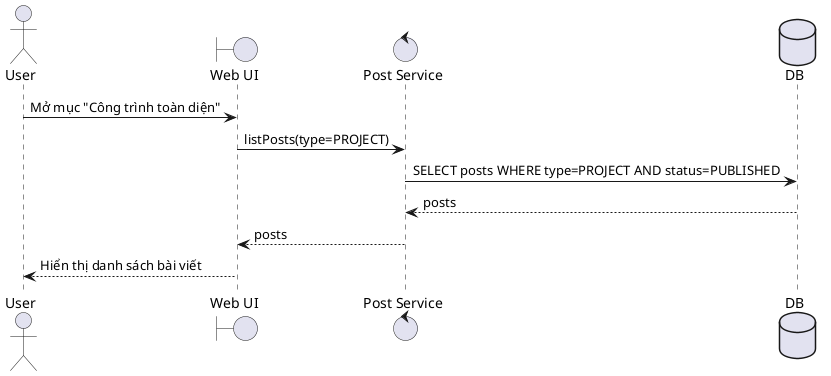

### A.4.9 Xem bài viết Giải pháp âm thanh (3.4.9)

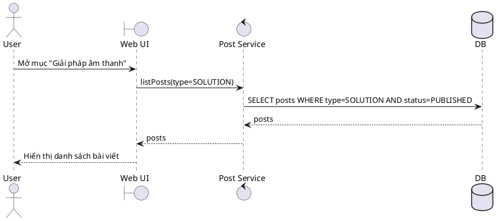

### A.4.10 Quản lý tài khoản của người dùng (3.4.10)

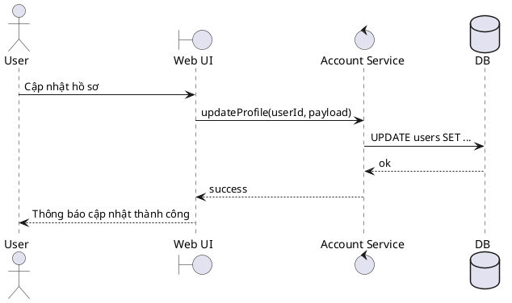

### A.4.11 Quản lý sản phẩm (3.4.11)

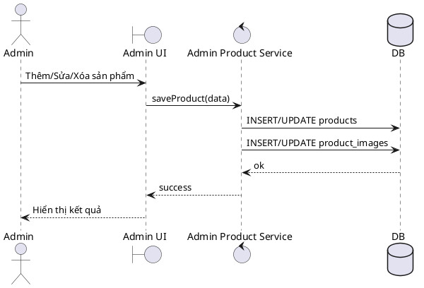

### A.4.12 Quản lý loại sản phẩm (3.4.12)

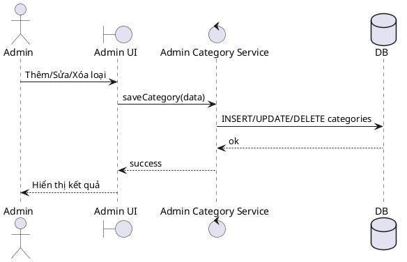

### A.4.13 Quản lý hãng sản phẩm (3.4.13)

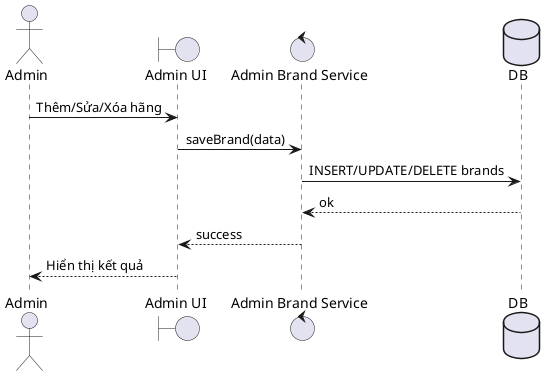

### A.4.14 Quản lý danh sách hóa đơn của người dùng (3.4.14)

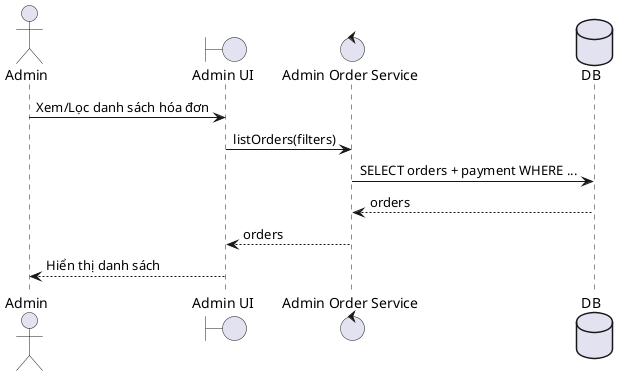

### A.4.15 Quản lý bài viết giải pháp âm thanh (3.4.15)

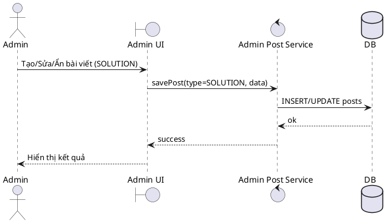

### A.4.16 Quản lý bài viết công trình toàn diện (3.4.16)

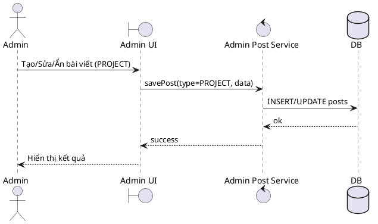

## A.5 Lược đồ cơ sở dữ liệu (3.5)

```plantuml
@startuml
hide circle
skinparam linetype ortho

entity "users" as users {
  * id : UUID <<PK>>
  --
  full_name : varchar
  email : varchar <<UK>>
  phone : varchar
  password_hash : varchar
  status : varchar
  created_at : datetime
}

entity "roles" as roles {
  * id : int <<PK>>
  --
  name : varchar <<UK>>
}

entity "user_roles" as user_roles {
  * user_id : UUID <<FK>>
  * role_id : int <<FK>>
}

entity "categories" as categories {
  * id : int <<PK>>
  --
  name : varchar
  slug : varchar <<UK>>
}

entity "brands" as brands {
  * id : int <<PK>>
  --
  name : varchar
  country : varchar
}

entity "products" as products {
  * id : UUID <<PK>>
  --
  category_id : int <<FK>>
  brand_id : int <<FK>>
  name : varchar
  sku : varchar <<UK>>
  price : decimal
  stock_qty : int
  description : text
  status : varchar
  created_at : datetime
}

entity "product_images" as product_images {
  * id : UUID <<PK>>
  --
  product_id : UUID <<FK>>
  url : varchar
  is_primary : bool
}

entity "carts" as carts {
  * id : UUID <<PK>>
  --
  user_id : UUID <<FK>>
  status : varchar
  created_at : datetime
}

entity "cart_items" as cart_items {
  * id : UUID <<PK>>
  --
  cart_id : UUID <<FK>>
  product_id : UUID <<FK>>
  quantity : int
  unit_price : decimal
}

entity "orders" as orders {
  * id : UUID <<PK>>
  --
  user_id : UUID <<FK>>
  order_no : varchar <<UK>>
  status : varchar
  total_amount : decimal
  created_at : datetime
}

entity "order_items" as order_items {
  * id : UUID <<PK>>
  --
  order_id : UUID <<FK>>
  product_id : UUID <<FK>>
  quantity : int
  unit_price : decimal
  line_total : decimal
}

entity "payments" as payments {
  * id : UUID <<PK>>
  --
  order_id : UUID <<FK>>
  provider : varchar
  amount : decimal
  status : varchar
  transaction_id : varchar
  paid_at : datetime
}

entity "posts" as posts {
  * id : UUID <<PK>>
  --
  author_user_id : UUID <<FK>>
  type : varchar
  title : varchar
  content : text
  status : varchar
  published_at : datetime
}

users ||--o{ carts
carts ||--o{ cart_items
products ||--o{ cart_items

users ||--o{ orders
orders ||--o{ order_items
products ||--o{ order_items
orders ||--o| payments

categories ||--o{ products
brands ||--o{ products
products ||--o{ product_images

users ||--o{ posts
roles ||--o{ user_roles
users ||--o{ user_roles
@enduml
```
